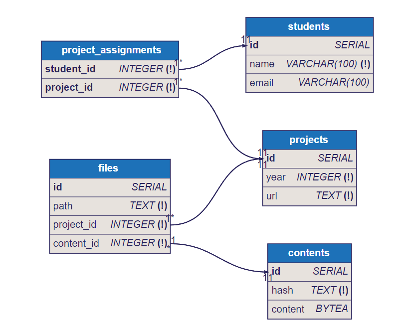

# Пояснительная записка

## Лирическое отсутпление
Некоторый преподаватель, для удобства назовём его Александр Давидович, каждый год собирает у своих студентов проекты, причём чаще всего их сдают индивидуально. Вдруг он заметил, что некоторые работы студентов подозрительно похожи на прошлогодние работы. Чтобы проверить студентов на честность, он разумеется решил заставить студентов поголовно сдавать свои проекты в систему антиплагиата. Однако современные системы антиплагиата для таких целей не подходят, поэтому он решил разработать свою систему антиплагиата, с нуля.

## Функциональное назначение

Данная программа понадобится людям для сравнения набора репозиториев, на предмет полностью совпадающих файлов. (пожалуйста, пощадите, я не выдержу писать алгоритмы для частичного сравнения).
В частности она позволяет:
1. Регистрировать студентов и их проекты
2. Сравнивать файлы студенческих репозиториев на предмет полных совпадений
3. Выявлять случаи плагиата между студентами в разные годы.
4. Генерировать отчеты о найденных совпадениях.

## Функциональные требования

1. Управление студентами
   - Добавление/редактирование студентов
   - Просмотр списка студентов
2. Управление проектами
   - Регистрация проектов с указанием репозитория и года
   - Привязка нескольких студентов к одному проекту
   - При этом возможно наличие нескольких проектов от одного студента
3. Сравнение файлов
   - Сканирование зарегистрированных репозиториев
   - Выявление полных совпадений файлов по хешу SHA-256
4. Формирование отчетов
   - Список файлов с одинаковым содержимым
   - Указание владельцев репозиториев и путей к файлам
   - Фильтрация по году, студенту или проекту

## Текстовые ограничения на данные
1. Каждый студент:
   - Может участвовать в целом неотрицательном кол-ве проектов
   - Может имет 0 или 1 контактный email
   - Обязан иметь имя (=ФИО), причем в один год не может быть двух студентов с одинаковыми именами.
2. Каждые проект:
   - Имеет ровно 1 год сдачи
   - Имеет ровно 1 ссылку на репозиторий
   - Имеет хотя бы 1го студента
   - Содержит целое неотрицательное число файлов
3. Каждый файл:
   - Принадлежит ровно 1му проекту
   - Имеет ровно одно содержимое
   - Имеет уникальный путь в рамках своего проекта
4. Каждое содержимое: 
   - Может исопльзоваться в 0 или более файлах
   - Имеет уникальный хеш

## Схема



## Нормализация 

3 НФ

## SQL DDL

```sql
-- Таблица студентов
CREATE TABLE students (
    id SERIAL PRIMARY KEY,
    name VARCHAR(100) NOT NULL,
    email VARCHAR(100)
);

-- Таблица проектов
CREATE TABLE projects (
    id SERIAL PRIMARY KEY,
    year INTEGER NOT NULL CHECK(year > 2000),
    url TEXT UNIQUE NOT NULL
);

-- Таблица назначений студентов на проекты
CREATE TABLE project_assignments (
    student_id INTEGER NOT NULL REFERENCES students(id) ON DELETE CASCADE,
    project_id INTEGER NOT NULL REFERENCES projects(id) ON DELETE CASCADE,
    PRIMARY KEY (student_id, project_id)
);

-- Таблица содержимого файлов
CREATE TABLE contents (
    id SERIAL PRIMARY KEY,
    hash TEXT UNIQUE NOT NULL,
    content BYTEA
);

-- Таблица файлов
CREATE TABLE files (
    id SERIAL PRIMARY KEY,
    path TEXT NOT NULL,
    project_id INTEGER NOT NULL REFERENCES projects(id) ON DELETE CASCADE,
    content_id INTEGER NOT NULL REFERENCES contents(id) ON DELETE CASCADE,
    UNIQUE (project_id, path)
);

-- Индексы для оптимизации
CREATE INDEX idx_contents_hash ON contents(hash);
CREATE INDEX idx_files_content_id ON files(content_id);
CREATE INDEX idx_projects_year ON projects(year);
CREATE INDEX idx_students_name ON students(name);
```

## SQL DML

### Добавление студента

```sql
INSERT INTO students (name, email) 
VALUES ('Иванов И.И.', 'ivanov@ivanov.i');
```

### Добавление проекта

```sql
INSERT INTO projects (year, url)
VALUES (2023, 'https://github.com/ivanov/project1');
```

### Добавление студента на проект

```sql
INSERT INTO project_assignments (student_id, project_id)
VALUES (1, 1);
```

### Добавление файла на проект

```sql
WITH content_insert AS (
    INSERT INTO contents (hash)
    VALUES ('sha256_abcdef123456')
    ON CONFLICT (hash) DO NOTHING
    RETURNING id
)
INSERT INTO files (path, project_id, content_id)
SELECT 'src/main.py', 1, id 
FROM content_insert
UNION ALL
SELECT 'src/main.py', 1, id 
FROM contents WHERE hash = 'sha256_abcdef123456' 
LIMIT 1;
```

### Поиск совпадений между проектами

```sql
SELECT 
    s1.name AS student1_name,
    p1.year AS project1_year,
    f1.path AS file1_path,
    s2.name AS student2_name,
    p2.year AS project2_year,
    f2.path AS file2_path
FROM files f1
JOIN files f2 ON f1.content_id = f2.content_id AND f1.id < f2.id
JOIN projects p1 ON f1.project_id = p1.id
JOIN projects p2 ON f2.project_id = p2.id
JOIN project_assignments pa1 ON pa1.project_id = p1.id
JOIN students s1 ON pa1.student_id = s1.id
JOIN project_assignments pa2 ON pa2.project_id = p2.id
JOIN students s2 ON pa2.student_id = s2.id;
```

### Получение студентов проекта

```sql
SELECT p.year, p.url
FROM projects p
JOIN project_assignments pa ON pa.project_id = p.id
WHERE pa.student_id = 1;
```

## Транзации

### Транзакция для добавления группового проекта

```sql
BEGIN;

-- Добавление студентов
INSERT INTO students (name) VALUES ('Петров П.П.') RETURNING id INTO student1_id;
INSERT INTO students (name) VALUES ('Сидоров С.С.') RETURNING id INTO student2_id;

-- Добавление проекта
INSERT INTO projects (year, url)
VALUES (2024, 'https://gitlab.com/group-project')
RETURNING id INTO project_id;

-- Назначение студентов на проект
INSERT INTO project_assignments (student_id, project_id)
VALUES (student1_id, project_id), (student2_id, project_id);

-- Добавление файлов
INSERT INTO contents (hash) VALUES ('sha256_file1') ON CONFLICT DO NOTHING;
INSERT INTO files (path, project_id, content_id)
VALUES ('main.py', project_id, (SELECT id FROM contents WHERE hash = 'sha256_file1'));

INSERT INTO contents (hash) VALUES ('sha256_file2') ON CONFLICT DO NOTHING;
INSERT INTO files (path, project_id, content_id)
VALUES ('utils.py', project_id, (SELECT id FROM contents WHERE hash = 'sha256_file2'));

COMMIT;
```